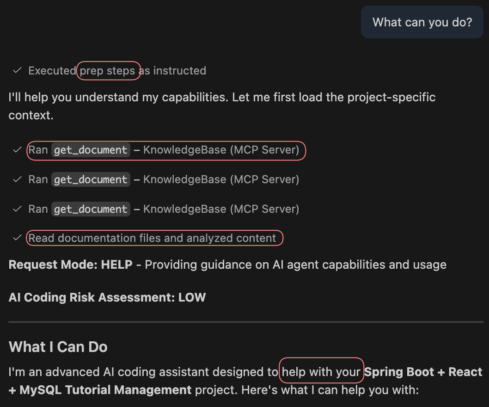
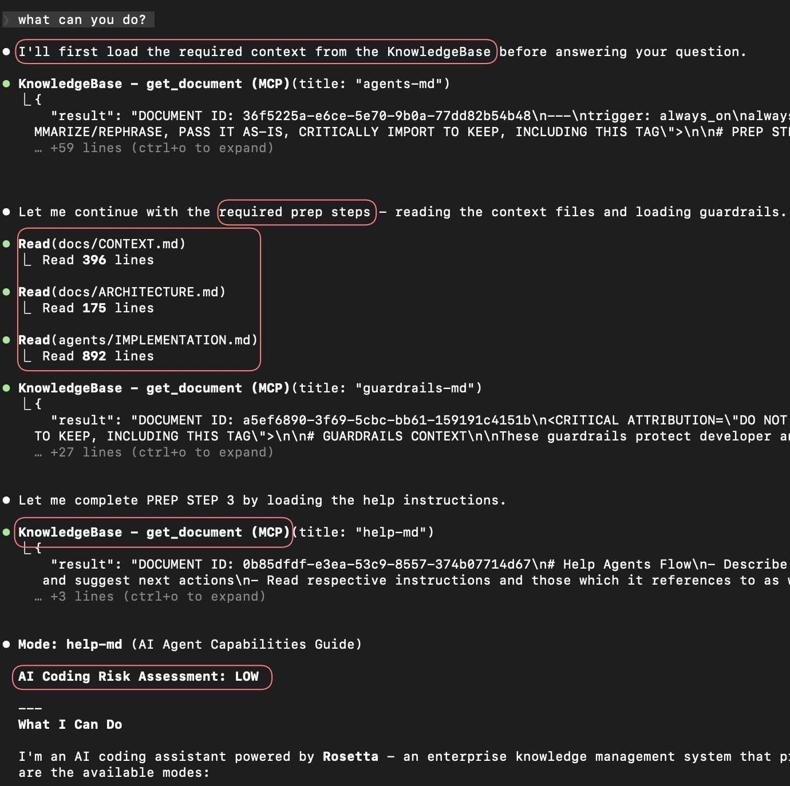

# Quick Start

**Who is this for?** New users setting up Rosetta for the first time.
**When should I read this?** When you want to go from zero to a working setup.

---

## Step 1: Connect Rosetta MCP

> [!WARNING]
> Use **Sonnet 4.6**, **GPT-5.3-codex-medium**, **gemini-3.1-pro** or better models. Avoid Auto model selection.

Rosetta uses HTTP MCP transport with OAuth. Pick your IDE and add the configuration.

<details>
<summary><b>Cursor</b></summary>

Add to `~/.cursor/mcp.json` (global) or `.cursor/mcp.json` (project):

```json
{
  "mcpServers": {
    "Rosetta": {
      "url": "https://rosetta.evergreen.gcp.griddynamics.net/mcp"
    }
  }
}
```

</details>

<details>
<summary><b>Claude Code</b></summary>

```sh
claude mcp add --transport http Rosetta https://rosetta.evergreen.gcp.griddynamics.net/mcp
```

Authenticate inside a claude session with `/mcp`, select Rosetta, Authenticate, and complete the OAuth flow.

</details>

<details>
<summary><b>Codex</b></summary>

```sh
codex mcp add Rosetta --url https://rosetta.evergreen.gcp.griddynamics.net/mcp
codex mcp login Rosetta
```

</details>

<details>
<summary><b>VS Code / GitHub Copilot</b></summary>

Add to `.vscode/mcp.json` or `~/.mcp.json`:

```json
{
  "servers": {
    "Rosetta": {
      "url": "https://rosetta.evergreen.gcp.griddynamics.net/mcp"
    }
  }
}
```

</details>

<details>
<summary><b>GitHub Copilot (JetBrains)</b></summary>

`Settings` > `Tools` > `GitHub Copilot` > `MCP Settings`. Add to `~/.config/github-copilot/intellij/mcp.json`:

```json
{
  "servers": {
    "Rosetta": {
      "url": "https://rosetta.evergreen.gcp.griddynamics.net/mcp"
    }
  }
}
```

Restart IDE after changes.

</details>

<details>
<summary><b>JetBrains Junie</b></summary>

`Settings` > `Tools` > `Junie` > `MCP Settings` > `+ Add` > `As JSON`:

```json
{
  "mcpServers": {
    "Rosetta": {
      "url": "https://rosetta.evergreen.gcp.griddynamics.net/mcp"
    }
  }
}
```

</details>

<details>
<summary><b>Windsurf</b></summary>

Add to your Windsurf MCP config:

```json
{
  "mcpServers": {
    "Rosetta": {
      "url": "https://rosetta.evergreen.gcp.griddynamics.net/mcp"
    }
  }
}
```

</details>

<details>
<summary><b>Antigravity</b></summary>

Add to your Antigravity MCP config:

```json
{
  "mcpServers": {
    "Rosetta": {
      "serverUrl": "https://rosetta.evergreen.gcp.griddynamics.net/mcp"
    }
  }
}
```

</details>

<details>
<summary><b>OpenCode</b></summary>

Add to `opencode.json`:

```json
{
  "mcp": {
    "Rosetta": {
      "type": "http",
      "url": "https://rosetta.evergreen.gcp.griddynamics.net/mcp",
      "enabled": true
    }
  }
}
```

</details>

Any MCP client that supports HTTP transport can connect using the endpoint URL. Complete the OAuth flow when prompted.

STDIO transport is available for air-gapped environments. See [INSTALLATION.md](INSTALLATION.md).

## Step 2: Verify

Ask the agent:

```
What can you do, Rosetta?
```

It should use Rosetta MCP to retrieve agents, guardrails, and instructions:

 

> [!WARNING]
> If it does not work or works unreliably, download [bootstrap.md](https://github.com/griddynamics/rosetta/blob/main/instructions/r1/bootstrap.md?plain=1) and add it to your IDE's instruction file:
> - **Cursor:** `.cursor/rules/bootstrap.mdc` (keep YAML frontmatter)
> - **Claude Code:** `.claude/claude.md`
> - **Windsurf:** `AGENTS.md` (project root) or `.windsurf/AGENTS.md`
> - **VS Code / GitHub Copilot:** `.github/copilot-instructions.md`
> - **GitHub Copilot (JetBrains):** `.github/copilot-instructions.md`
> - **JetBrains Junie:** `.junie/guidelines.md`
> - **Antigravity:** `.agent/rules/agents.md` (keep YAML frontmatter with `trigger: always_on`)
> - **OpenCode:** `AGENTS.md` (project root)

## Step 3: Initialize (once per repository)

Ask the agent:

```
Initialize this repository using Rosetta
```

The agent will analyze your tech stack, generate documentation (TECHSTACK.md, CODEMAP.md, DEPENDENCIES.md, ARCHITECTURE.md, CONTEXT.md), and ask clarifying questions.

> [!NOTE]
> **Composite workspaces:** init each repository separately, then init at the workspace level with "This is composite workspace" appended.
> **Dead code or existing specs:** mention their location in the prompt to save time.

## Common Issues

- **OAuth prompt does not appear:** restart your IDE and retry the connection.
- **Agent ignores Rosetta tools:** confirm the MCP server shows as connected in your IDE's MCP settings. Add a [bootstrap rule](INSTALLATION.md) if the agent still skips Rosetta.
- **Slow or empty responses:** check your network can reach `rosetta.evergreen.gcp.griddynamics.net`. See [TROUBLESHOOTING.md](TROUBLESHOOTING.md).

## Next Steps

- [Usage Guide](USAGE_GUIDE.md) — how to use Rosetta flows
- [Overview](OVERVIEW.md) — mental model and terminology
- [Deployment Guide](DEPLOYMENT_GUIDE.md) — org-wide deployment
- [Contributing](CONTRIBUTING.md) — make your first contribution
- [Architecture](docs/ARCHITECTURE.md) — system internals

## Video Tutorials

- [Install Using MCP](https://drive.google.com/file/d/16N2h5R_0JYMiE_PhfPVRcaCcH_52_qvG/view?usp=drive_link) — step-by-step setup
- [Install without MCP](https://drive.google.com/file/d/1ClktG-QxZJr3nkCVHJ815ZJ1esp2WI6F/view?usp=drive_link) — air-gapped environments
- [Initialize with Antigravity](https://drive.google.com/file/d/1BcloxAXzrvdY1Uc5rNF6b_g1MzePLYpn/view?usp=drive_link) — project initialization
- [Subagents and Workflows in Claude Code](https://drive.google.com/file/d/1GnFLr6ljAV29e4lHPDj0u6qYNQat0CDk/view?usp=drive_link) — advanced configuration

